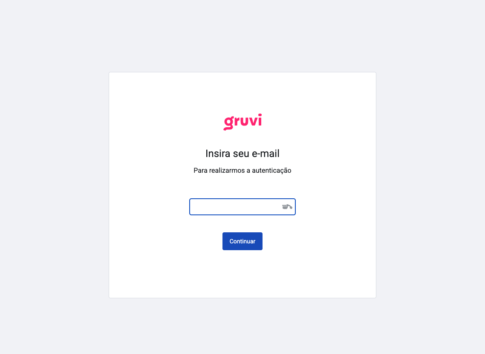
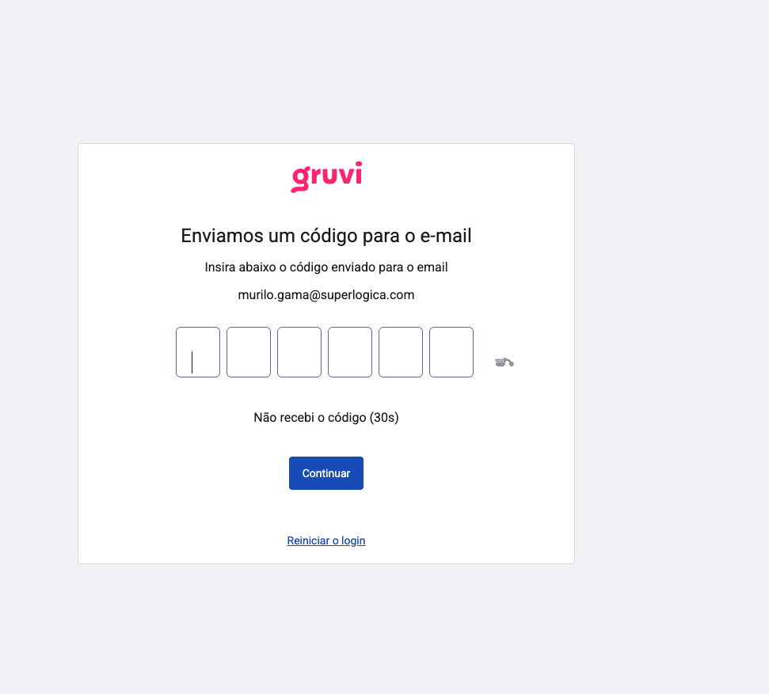

Este guia mostra como acessar o portal passo a passo.

## Passo 1: Acessar o domínio

Acesse o domínio do portal: **portal.gruvi.app**

## Passo 2: Inserir email

Na tela inicial, insira seu endereço de email cadastrado.

## Passo 3: Inserir código de verificação

Após inserir o email, você receberá um código de verificação por email. Insira esse código no campo indicado.

:::caution

Nunca forneça seu código de verificação a terceiros. Este código é pessoal e intransferível. Se alguém solicitar seu código, não compartilhe.

:::
